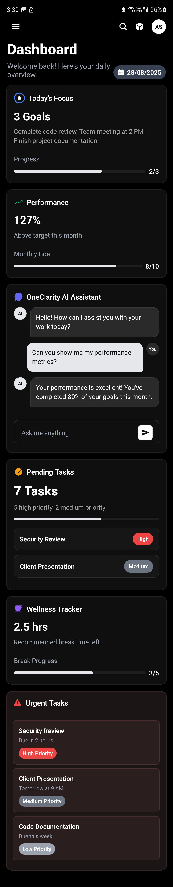
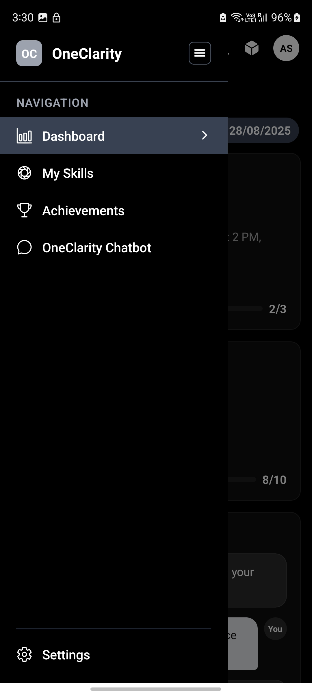
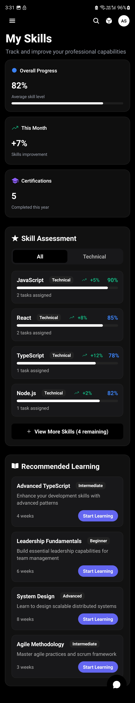
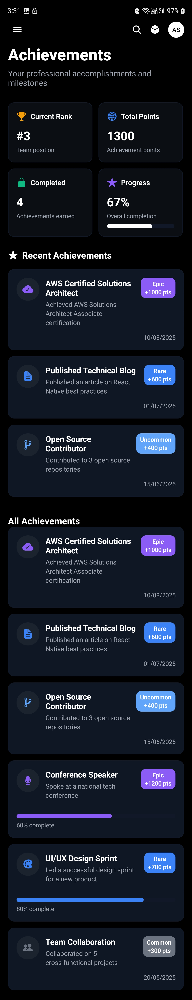
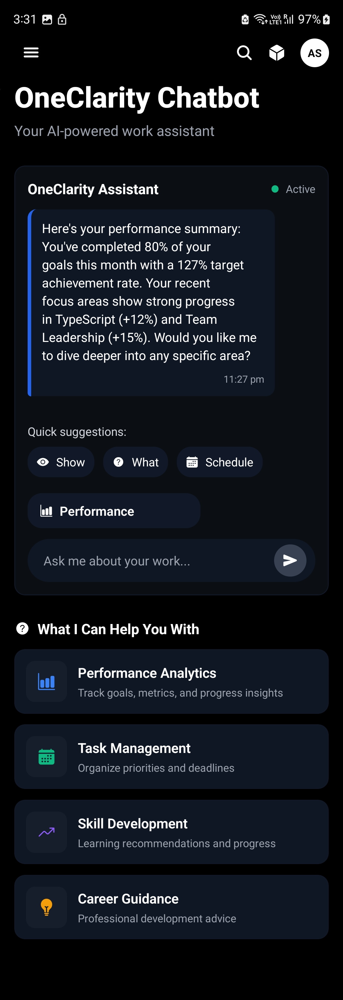
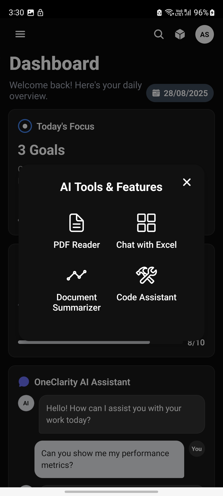
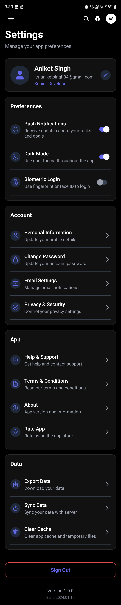

# OneClarity.ai Employee Dashboard

A modern, mobile-friendly React Native Employee Dashboard app built for OneClarity.ai as part of an intern task. This comprehensive dashboard allows employees to access organization-related features with a clean, intuitive interface.

## 📱 App Screenshots

### Dashboard Overview

*Main dashboard with performance metrics, goals tracking, and quick actions*

### App Drawer Navigation

*Side drawer navigation showing all available sections*

### Skills Management

*Skills tracking interface with progress visualization and learning recommendations*

### Achievements System

*Achievement collection and ranking system with rarity levels*

### AI Chatbot

*Interactive AI assistant interface with quick suggestions*

### AI Tools

*Additional AI-powered tools and features*

### Settings & Profile

*User settings and profile management interface*

## 🎯 Project Overview

This project was developed as an intern task for OneClarity.ai, demonstrating proficiency in:
- React Native development with TypeScript
- Modern mobile UI/UX design principles
- Component-based architecture
- Navigation implementation
- State management
- Responsive design for both iOS and Android

## 📋 Intern Task Requirements

### Objective
Build a mobile-friendly Employee Dashboard in React Native that allows employees to access their organization-related features with multiple pages serving different functions.

### Scope of Work
- ✅ Develop all pages as per provided designs
- ✅ Ensure responsive UI (Android + iOS)
- ✅ Follow design guidelines
- ✅ Write clean and reusable code

### Deliverables
- ✅ Fully functional React Native Employee Dashboard app (UI + dummy data)
- ✅ All pages connected through navigation
- ✅ Clean folder structure (components, screens, assets)
- ✅ Code pushed to GitHub repo with commits per feature
- ✅ Comprehensive README explaining setup & usage

## Features

### 🏠 Dashboard
- **Today's Focus**: Goals with progress tracking
- **Performance**: Monthly goal progress with percentage
- **AI Assistant**: Quick access to chatbot
- **Pending Tasks**: Task list with priority levels
- **Wellness Tracker**: Break time management
- **Urgent Tasks**: High-priority task alerts

### 🎯 Skills Management
- **Skill Tracking**: Monitor skill development and growth
- **Progress Visualization**: Level-based progress bars
- **Recommendations**: Personalized learning suggestions
- **Categories**: Organized by skill types

### 🏆 Achievements
- **Rank System**: User ranking and points
- **Achievement Grid**: Visual achievement collection
- **Rarity Levels**: Common, Uncommon, Rare, Epic, Legendary
- **Progress Tracking**: Locked achievements with progress

### 🤖 AI Chatbot
- **Smart Assistant**: AI-powered help system
- **Quick Suggestions**: Category-based quick actions
- **Real-time Chat**: Interactive messaging interface
- **Categories**: Performance, Tasks, Skills, Career

### ⚙️ Settings
- **Profile Management**: User profile and preferences
- **Notifications**: Push notification controls
- **Security**: Biometric login options
- **App Preferences**: Theme and behavior settings

## 🛠️ Tech Stack

- **React Native** with Expo SDK 54
- **TypeScript** for type safety and better development experience
- **React Navigation** v7 for drawer and stack navigation
- **Expo Vector Icons** for consistent iconography
- **React Native Gesture Handler** for smooth touch interactions
- **React Native Reanimated** for animations
- **React Native Safe Area Context** for proper screen handling

## 🏗️ Architecture & Design Decisions

### Component Architecture
- **Reusable Components**: Created common components in `src/components/common/` for consistency
- **Screen Components**: Each major feature has its own screen component
- **Custom Hooks**: State management pushed down to individual components to prevent re-renders
- **TypeScript Interfaces**: Comprehensive type definitions for all data structures

### Navigation Structure
- **Drawer Navigation**: Main navigation using React Navigation Drawer
- **Stack Navigation**: Each section has its own stack for future expansion
- **Type Safety**: Full TypeScript support for navigation parameters

### State Management
- **Local State**: Using React hooks for component-level state
- **Mock Data**: Centralized mock data in `src/data/mockData.ts`
- **Props Drilling**: Minimized by keeping state close to where it's used

### UI/UX Principles
- **Dark Theme**: Modern dark theme with consistent color palette
- **Responsive Design**: Optimized for both iOS and Android
- **Accessibility**: Proper contrast ratios and touch targets
- **Performance**: Optimized rendering with proper component structure

## Project Structure

```
src/
├── components/
│   └── common/           # Reusable UI components
├── screens/
│   ├── Dashboard/        # Main dashboard screen
│   ├── Skills/          # Skills management
│   ├── Achievements/    # Achievement system
│   ├── Chatbot/         # AI assistant
│   ├── Settings/        # App settings
│   └── Auth/            # Authentication
├── navigation/           # Navigation setup
├── data/                # Mock data and types
├── types/               # TypeScript definitions
└── utils/               # Utility functions
```

## Getting Started

### Prerequisites
- Node.js (v16 or higher)
- npm or yarn
- Expo CLI

### Installation

1. Clone the repository
2. Install dependencies:
   ```bash
   npm install
   ```

3. Start the development server:
   ```bash
   npm run web      # For web development
   npm run ios      # For iOS simulator
   npm run android  # For Android emulator
   ```

### Development

The app uses a modular architecture with:
- **Reusable Components**: Common UI elements in `src/components/common/`
- **Screen Components**: Individual screens in `src/screens/`
- **Type Safety**: Full TypeScript support
- **Mock Data**: Realistic dummy data for development

## Design System

### Colors
- **Primary**: #6366F1 (Indigo)
- **Background**: #111827 (Dark Gray)
- **Surface**: #1F2937 (Card Background)
- **Text**: #FFFFFF (Primary), #9CA3AF (Secondary)
- **Accent**: #F59E0B (Gold), #10B981 (Green), #EF4444 (Red)

### Typography
- **Headings**: Bold, 18-28px
- **Body**: Regular, 14-16px
- **Captions**: Regular, 12px

## Features Implemented

✅ **Complete Navigation System**
- Drawer navigation with 5 main sections
- Stack navigation for each section
- Proper TypeScript navigation types

✅ **Dashboard Screen**
- Performance metrics with progress bars
- Goal tracking with visual progress
- Task management with priority badges
- Wellness tracking with recommendations
- AI assistant quick access

✅ **Skills Screen**
- Skill level tracking
- Progress visualization
- Learning recommendations
- Category organization

✅ **Achievements Screen**
- User ranking system
- Achievement collection
- Rarity-based categorization
- Progress tracking for locked achievements

✅ **Chatbot Screen**
- Interactive chat interface
- Quick suggestion buttons
- Category-based responses
- Real-time messaging simulation

✅ **Settings Screen**
- User profile management
- App preferences
- Security settings
- Help and support options

✅ **Authentication Screen**
- Login/signup forms
- Demo mode
- Form validation
- Modern UI design

## 🚀 Development Process

### Development Approach
- **Feature-based Development**: Each major feature developed as a separate component
- **Incremental Commits**: Regular commits for each feature implementation
- **TypeScript First**: All components written with TypeScript from the start
- **Component Reusability**: Focus on creating reusable components following user rules

### Key Implementation Highlights
- **State Management**: Followed the rule of pushing state down to prevent unnecessary re-renders
- **Component Organization**: Created components in dedicated folders before importing
- **Clean Architecture**: Separated concerns with proper folder structure
- **Type Safety**: Comprehensive TypeScript interfaces for all data structures

### Git Commit Strategy
- Initial project setup with Expo and TypeScript
- Navigation system implementation
- Dashboard screen with performance metrics
- Skills management with progress tracking
- Achievements system with ranking
- AI chatbot interface
- Settings and profile management
- Authentication screens
- UI polish and final touches

## 🔮 Future Enhancements

- [ ] Real API integration with backend services
- [ ] Push notifications for task reminders
- [ ] Offline support with data synchronization
- [ ] Data persistence with local storage
- [ ] Advanced analytics and reporting
- [ ] Team collaboration features
- [ ] Custom themes and personalization
- [ ] Enhanced accessibility features
- [ ] Performance optimizations
- [ ] Unit and integration testing

## Contributing

1. Fork the repository
2. Create a feature branch
3. Make your changes
4. Test thoroughly
5. Submit a pull request

## ✅ Project Completion Status

### Completed Features
- [x] **Complete Navigation System** - Drawer and stack navigation
- [x] **Dashboard Screen** - Performance metrics, goals, tasks, wellness
- [x] **Skills Management** - Skill tracking with progress visualization
- [x] **Achievements System** - Ranking, points, and achievement collection
- [x] **AI Chatbot Interface** - Interactive chat with quick suggestions
- [x] **Settings & Profile** - User management and app preferences
- [x] **Authentication Screens** - Login/signup with form validation
- [x] **Responsive Design** - Optimized for both iOS and Android
- [x] **TypeScript Implementation** - Full type safety throughout
- [x] **Component Architecture** - Reusable components and clean structure
- [x] **Mock Data Integration** - Realistic dummy data for all features

### Technical Achievements
- ✅ Modern React Native development with Expo
- ✅ TypeScript for enhanced development experience
- ✅ Clean, maintainable code architecture
- ✅ Responsive UI design following mobile best practices
- ✅ Component reusability and modular structure
- ✅ Proper state management to prevent re-renders
- ✅ Comprehensive navigation system
- ✅ Professional UI/UX design

## 📞 Contact

**Developer**: Aniket Singh  
**Project**: OneClarity.ai Employee Dashboard  
**Task**: Intern Assignment - Mobile App Development  
**Repository**: [GitHub Repository Link]

---

*This project was developed as part of an intern task for OneClarity.ai, demonstrating proficiency in React Native development, TypeScript, and modern mobile app architecture.*

## License

This project is licensed under the MIT License.
